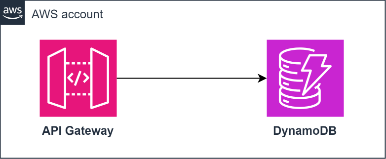

# API Gateway + Dynamodb



## 🧪 Test it with **Gitpod**
[](https://gitpod.io/#https://github.com/veben/aws_tf_apigateway_dynamodb)

## 🧪 Test it without Gitpod
### 1. 📝 Preparation
- Follow [installations](https://github.com/veben/aws_terraform_snippets/blob/main/readme.md#installations)
- Choose **Cloud hosting** or **Localstack** hosting and follow the different steps

### 2. 🏃 Running
> You can follow this steps or directly launch the script `./bin/run.sh`
- Recover the API key from tf output
```sh🪂
API_KEY=$(tflocal output -json | jq -r .apigw_key.value)
```
- Recover the API id
```sh
REST_API=$(aws apigateway --endpoint-url=http://localhost:4566 get-rest-apis | jq -r '.items[0].id')
```
- Insert data in Dynamodb via API
```sh
curl $REST_API.execute-api.localhost.localstack.cloud:4566/v1/pets -H "x-api-key: ${API_KEY}" -H 'Content-Type: application/json' --request POST --data-raw '{ "PetType": "dog", "PetName": "tito", "PetPrice": 250 }'
```
- Request the inserted data
```sh
curl -H "x-api-key: ${API_KEY}" --request GET $REST_API.execute-api.localhost.localstack.cloud:4566/v1/pets/dog
```

### 3. 🚿 Cleaning
```sh
tflocal destroy --auto-approve
```